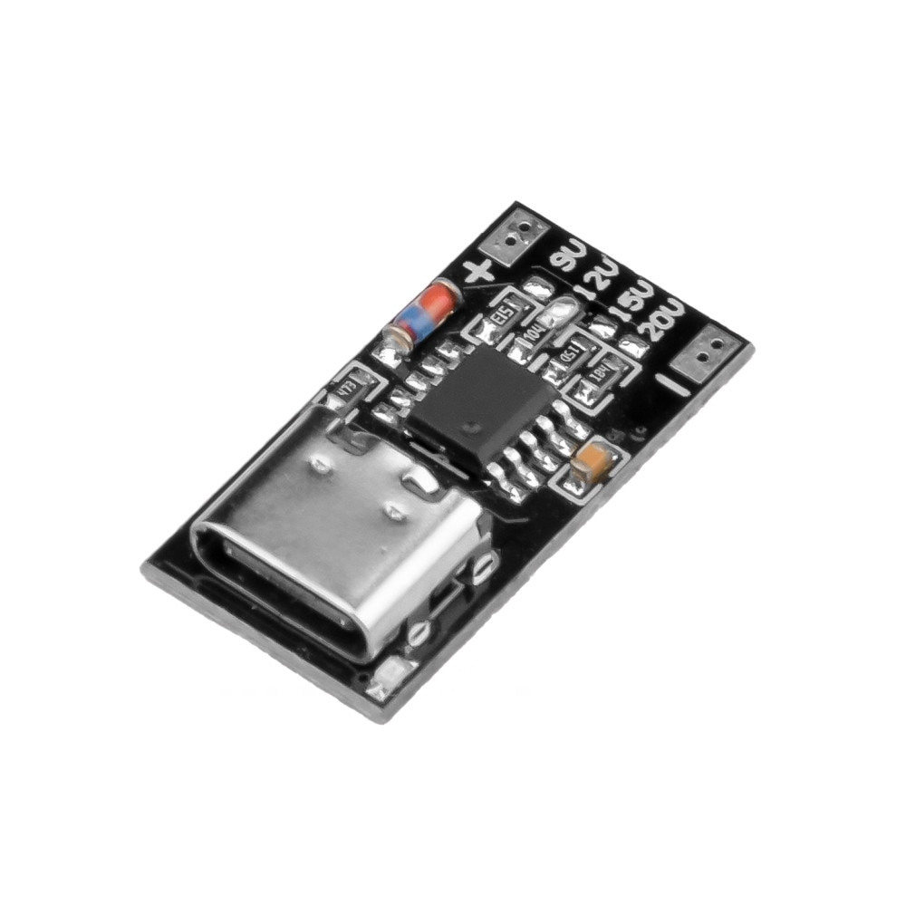
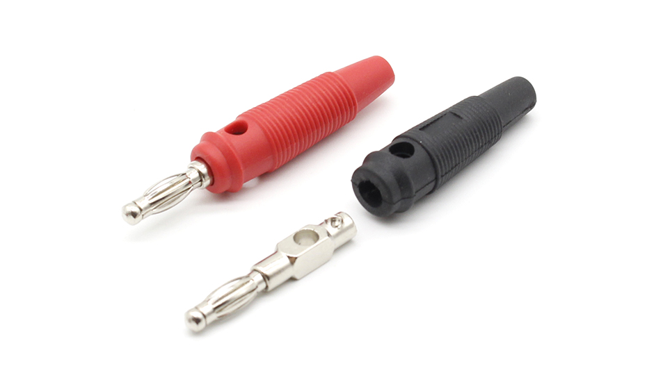
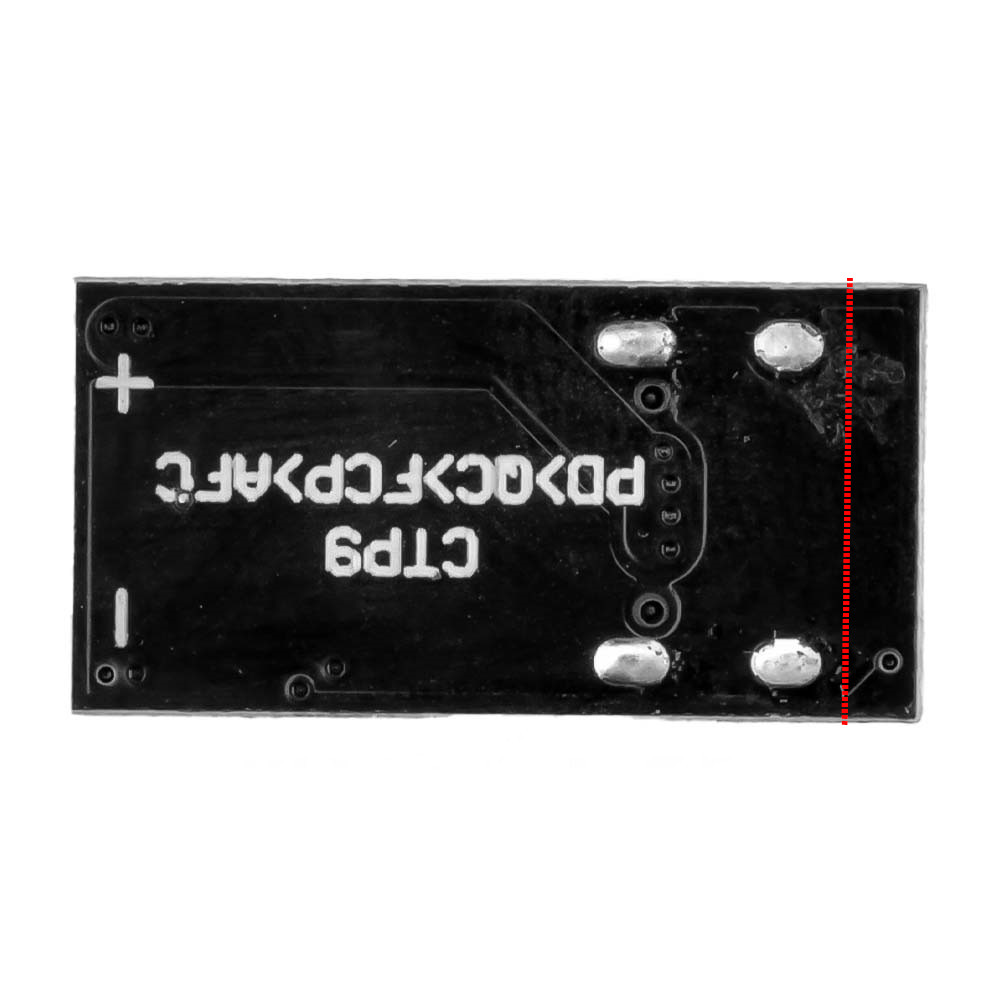

# USB PD to banana connectors
## BOM
 - 1x USB PD trigger module 
 - 2x banana plugs 
 - 2x countersunk flathead M3x10 screws with nuts.

Since the positioning of the typec connector is not on the edge of the board, ~1.5mm of PCB needs to be cut to make the connector protrude from the module. .

To insulate the screws from the terminals, there should be enough space to put insulating tape on the screw thread.

